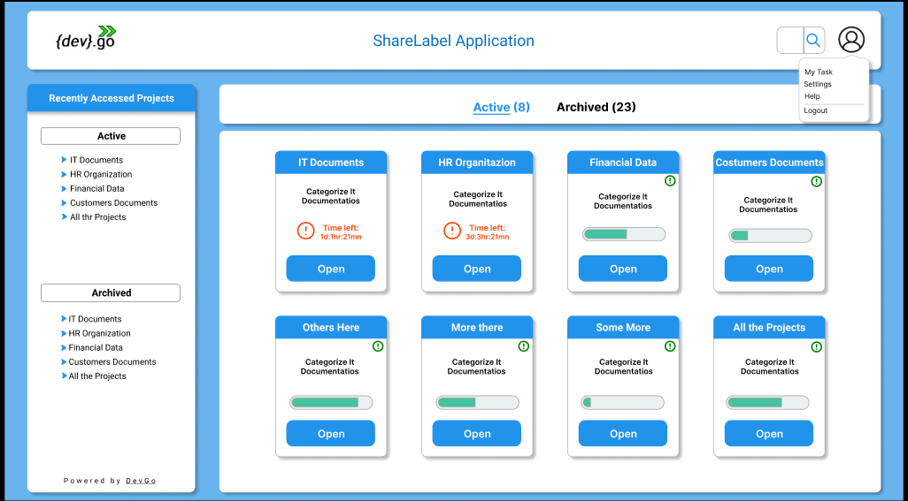

## Project

 
We use the term project to define the files and folders you will have on a specific local network path.

When the administrator adds a project, it is necessary to provide a name, description, and the local network path to it.

The administrator also determine which users and labels will be available to that project, the date that the projected will be archived(users don't access them anymore) and set a notification that will be fired when the project is about to be archived.

All this information provided by the administrator will become accessible in the application's front end for the end users.

If the administrator creates a project and assign no users for it, the users won't be able to see this project when they login to their account in the application.

The following figure illustrate the way you will create projects:

And this figure shows how the projects you created will appear for the end users you assign:

