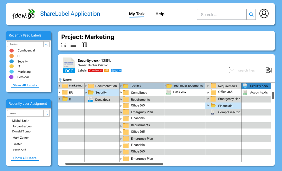

> Devgo, and it is Acomplished!
<h2>Welcome to the Ez2Cloud support and documentation site!</h2> 
EZ2Cloud is a cloud-based software, developed by DevGo, to provide a solution to inventory and labeling folders and files stored on the company files server. Here you will find all Software documentation.  

Ez2Cloud it is a software which the main goal is provide support tools be used on File Servers data migration process. With all the features allowing organize, classify and labeling file serves network shares contents based on the metadata for files and folders this is the better option to move on-premise servers contents to a cloud service in fast, reliable, secure and with minimum workload effort.

### Overview

 

We are seeking to deliver support tools that allow a smooth transition between on-premises network file servers to cloud. The main issue with this transition on most companies it is guarantee the use of automation tools to copy data volumes with less human intervention as possible. To do so, it is mandatory to maintain the data files but also all the metadata.

Most tools used for data copy must have the input in a specific format, but theirs is no means that allows one to create an underlined structured of the data from a company organization view, identify orphan data or set data ownership in an end-user friendly approach. 
Ez2Cloud was designed and implemented to address these issues. It is possible to export from Ez2Cloud a file formatted and ready to be used by an automation process with the minimum human intervention. Different from existing solutions on this, Ez2cloud will allow you to include metadata and so set a clear and concise view of structure, ownership and custom labels you want to apply to a shared network data on a file server.

All the configurations tasks, settings definitions, customizations and requirements to fulfil before use E2Cloud on your company will be the content of the following sections. Follow the links and you can access to specific concepts that one will need to get up and running with Ez2Cloud.

Essential Documentation | IT Admin and Technical Documentation
------------ | -------------
[User documentation](./Essentials/index.md) | [Administrator documentation](./ITAdmin/intro.md)
[Ez2Cloud Entitites](./Essentials/Concepts/index.md) | [Install and Configure Sattelite Server](./ITAdmin/satserver.md)
| [Configure Identity Provider](./ITAdmin/identi.md)

